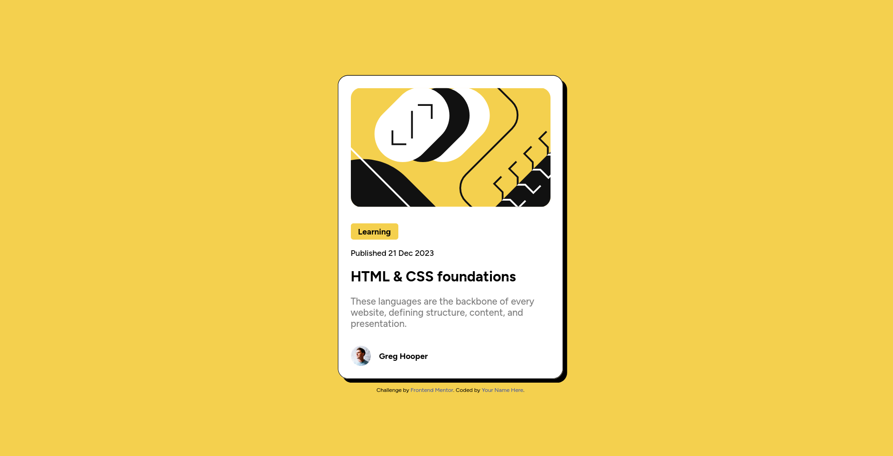

# Frontend Mentor - Blog preview card solution

Here is my solution to the [Blog preview card challenge on Frontend Mentor](https://www.frontendmentor.io/challenges/blog-preview-card-ckPaj01IcS).

## Table of contents

- [Overview](#overview)
  - [The challenge](#the-challenge)
  - [Screenshot](#screenshot)
  - [Links](#links)
- [My process](#my-process)
  - [Built with](#built-with)
  - [What I learned](#what-i-learned)
- [Author](#author)
- [Acknowledgments](#acknowledgments)

## Overview

### The challenge

Users should be able to:

- See hover and focus states for all interactive elements on the page

### Screenshot

### Links

- Github URL: https://your-solution-url.com
- Live Site URL: https://robertlikescoding.github.io/blog-preview-card/

## My process

I made a quick sketch in my head, imagining the structure of the HTML and then started writing it out.

### Built with

- Semantic HTML5 markup
- CSS custom properties
- Flexbox

### What I learned

I learned how to make an element appear to hover as a hover effect. I used `translateY` and `translateX` for it in this challenge.

## Author

- Website - [RobertLikesCoding](https://github.com/RobertLikesCoding/)
- Frontend Mentor - [@RobertLikesCoding](https://www.frontendmentor.io/profile/RobertLikesCoding)
